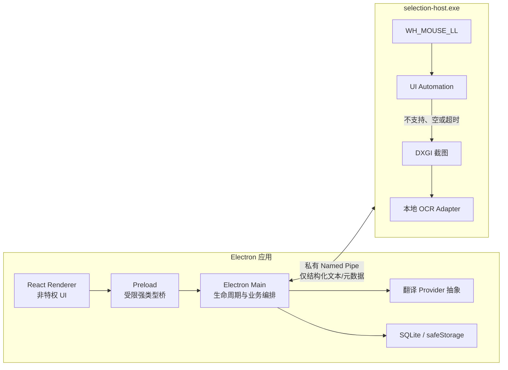
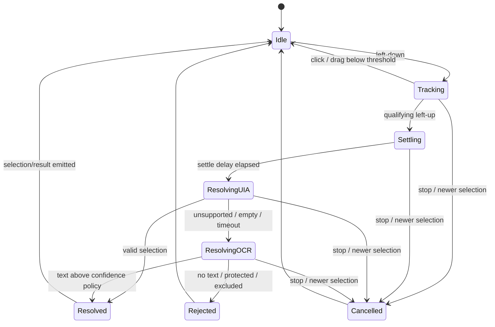

# 系统架构

## 1. 目标与边界

产品的唯一主路径是“用户划选屏幕文字 → 自动取得文字 → 翻译 → 在选区附近展示”。V1 不做输入框翻译、剪贴板轮询、模拟 `Ctrl+C` 或 AI 对话。

Windows 11 x64 是受支持的发布基线；Windows 10 22H2 x64 保留为兼容性目标，但其常规支持已结束，具体发布口径见 [兼容性矩阵](../compatibility/v1-matrix.md)。

架构优先保证：

1. 原生能力异常不能拖垮桌面 UI。
2. 鼠标 Hook 回调绝不执行阻塞工作。
3. UI Automation（UIA）是首选，局部截图 OCR 是回退。
4. 截图不跨进程、不落盘、不上传；在线翻译只接收最终文本。
5. 所有异步结果都以 `selectionId` 归属，旧结果不能覆盖新选区。

## 2. 进程与信任边界

| 组件 | 责任 | 明确禁止 |
|---|---|---|
| Renderer | React 页面、状态渲染、动画 | Node API、SQLite、供应商密钥、任意 IPC |
| Preload | 逐项暴露经校验的 UI API | 暴露原始 `ipcRenderer`、通用 `send/on` |
| Electron Main | 窗口/托盘生命周期、Native Host 监督、翻译调度、持久化 | 执行 UIA/OCR、保存截图 |
| Selection Host | 鼠标手势、UIA、屏幕裁剪、本地 OCR | 翻译联网、数据库写入、产品 UI |
| Translation Provider | 统一翻译能力和供应商适配 | 访问截图或原生窗口句柄 |
| Storage | 设置、排除列表、Provider 密文和 schema 迁移；历史/收藏/缓存仅预留表且 Phase 4/5 零写入 | 保存截图或明文密钥 |

Renderer 使用 `nodeIntegration: false`、`contextIsolation: true`、`sandbox: true`，只加载打包的本地资源并启用严格 CSP。Electron 官方建议隔离 Renderer、启用沙箱并逐项验证 IPC sender：[安全清单](https://www.electronjs.org/docs/latest/tutorial/security)、[Context Isolation](https://www.electronjs.org/docs/latest/tutorial/context-isolation)。

## 3. Native Host 生命周期

1. Main 生成每次启动唯一的 pipe 名称和 nonce，启动 `selection-host.exe`，传入 `--pipe`、`--parent-pid`、`--nonce`。
2. Host 创建本地、当前用户可访问的 Named Pipe；Main 连接并发送 `hello`。
3. Host 返回 `ready` 后，Main 才可发送 `start`。握手失败时划词功能保持关闭。
4. Main 定期调用 `health`；断线或子进程异常退出时清理所有未完成的 `selectionId`。
5. 重启采用有限次数指数退避；达到熔断阈值后保持 UI 可用并提示原生能力不可用。
6. 正常退出发送 `shutdown`，超时后才终止子进程。

选择独立进程的理由和 Pipe 安全细节见 [ADR-0001](../adr/0001-selection-host-and-named-pipe.md)。

## 4. Selection Host 线程模型

| 执行上下文 | 工作 | 约束 |
|---|---|---|
| 协调/Pipe 线程 | IPC、任务取消、状态机、父进程 watchdog | 不直接执行 UIA/OCR |
| Hook message-loop 线程 | 安装 `WH_MOUSE_LL`，记录按下/移动/抬起 | 回调只写入有界队列并立即 `CallNextHookEx` |
| UIA MTA worker | COM MTA 初始化、查找元素、`GetSelection()`、取文本/矩形 | 无窗口；单任务有截止时间；对象不跨 apartment 随意复用 |
| Capture/OCR worker | DXGI 取单帧、裁剪、OCR、释放像素 | 只处理获准的局部区域；一次只保留必要帧 |

微软说明低级 Hook 超时后可能被系统静默移除，因此回调必须快速返回并把工作交给专用 worker：[LowLevelMouseProc](https://learn.microsoft.com/en-us/windows/win32/winmsg/lowlevelmouseproc)。UIA 桌面客户端应在不拥有窗口的独立 COM MTA 线程上调用 UIA：[UIA 线程模型](https://learn.microsoft.com/en-us/windows/win32/winauto/uiauto-threading)。

## 5. 划词状态机

默认探针参数：抬起后稳定等待 `80 ms`、最小拖动距离 `4 physical px`、UIA 截止时间 `350 ms`、OCR 截止时间 `2500 ms`。它们是 Phase 1 的测量起点，不是未经实测的产品 SLA。

处理规则：

- 新合格手势产生新的 UUID `selectionId`，并取消旧任务。
- 优先从目标元素/其文本容器的 TextPattern 获取真实 selection；不能用 point range 冒充真实选区。
- `uia-point-approx` 只能作为明确标记的低可信候选，不得默认等同于真实 selection。
- UIA 标记为密码/受保护内容时立即拒绝，禁止进入 OCR。
- UIA 不可用、返回空、超时或目标是图像时，才进入局部 OCR。
- Hook 队列有界；过载时丢弃旧的移动事件，但不得丢失停止/关闭控制。
- Host 只向 Main 发送最终文本、范围、坐标、来源和置信度；不发送像素数据。

## 6. UIA 与 OCR

UIA 使用 `GetSelection()`、`GetText()` 和 bounding rectangles。控件是否可取词取决于目标应用是否实现 Text/Text2 pattern；Windows 没有覆盖所有应用的统一选区接口。参见 [Text 与 TextRange 模式](https://learn.microsoft.com/en-us/windows/win32/winauto/uiauto-about-text-and-textrange-patterns)。

OCR 输入来自鼠标拖拽区域与有限边距，按显示器边界裁剪。V1 以 DXGI Desktop Duplication 为主，处理旋转、`DXGI_ERROR_ACCESS_LOST` 和受保护内容；必要时可以有 GDI 兼容回退，但必须遵守同一隐私策略。DXGI 按显示器提供桌面图像：[Desktop Duplication API](https://learn.microsoft.com/en-us/windows/win32/direct3ddxgi/desktop-dup-api)。

OCR 通过内部 `OcrEngine` 接口注入，不让状态机依赖具体模型。当前 V1 使用系统
`Windows.Media.Ocr`，离线消费 Windows 已安装的 OCR language pack；应用不携带、下载或更新 OCR
模型。Paddle adapter 保留为未启用的替换边界；未来若改为第三方 runtime/model，必须新建 ADR、固定
runtime/model hash、核对许可证、增加模型质量与包体门禁，不能继承当前 Windows OCR 验收结论。

## 7. 数据与翻译边界

Selection Host 输出进入 Main 后，当前 Phase 4/5 主路径执行：规范化 → 显式 opt-in/凭据/语言门禁 →
Provider 调用或 source-only 降级 → UI 状态发布。当前只支持文本翻译，不实现历史、收藏、持久缓存、词典、
音标、发音或例句；未来新增能力必须先扩展产品规格和数据生命周期，禁止从预留 Schema 推断功能已存在。

SQLite 只能由 Main 访问。当前 Schema 包含 `settings`、`translation_history`、`favorites`、
`translation_cache`、`app_exclusions`、`schema_migrations`、`secrets`；其中 history/favorites/cache 是预留表，
Phase 4/5 保持零写入。`secrets` 仅保存 `safeStorage` 密文；Windows 下 safeStorage 使用 DPAPI，但不能防御
同一用户上下文中的恶意进程：[Electron safeStorage](https://www.electronjs.org/docs/latest/api/safe-storage)。

## 8. 可观测性与失效策略

- 指标只记录耗时、来源、成功/失败类型、字符数区间；默认不记录原文、译文、窗口标题或截图。
- 日志使用稳定错误码，不包含供应商密钥、nonce、完整 pipe 名或敏感 payload。
- UIA 超时只影响该次 selection；OCR 不可用时可以返回明确失败，不阻塞 Hook。
- Host 崩溃不影响 Main/Renderer；Main 崩溃时 Host 的父进程 watchdog 必须自行退出。
- 所有外部输入（UIA 文本、OCR 文本、Pipe JSON、Provider 响应）在信任边界处校验长度和类型。

## 9. Phase 边界

Phase 1 的可执行物仅用于验证：协议编解码、Host 生命周期、Hook/UIA/DXGI/OCR 探针、DPI/权限行为和测试夹具。Phase 2 才实现悬浮球；Phase 3 才把划词链路接入产品交互；Phase 4 才接入翻译供应商。
